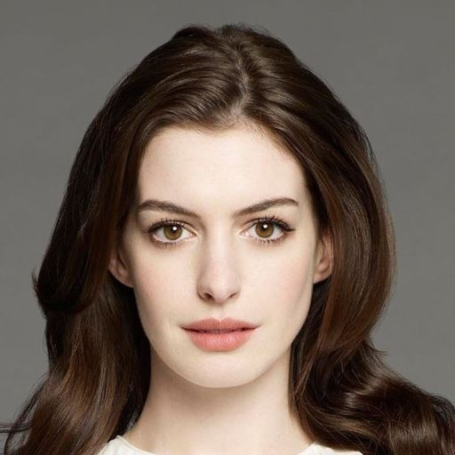
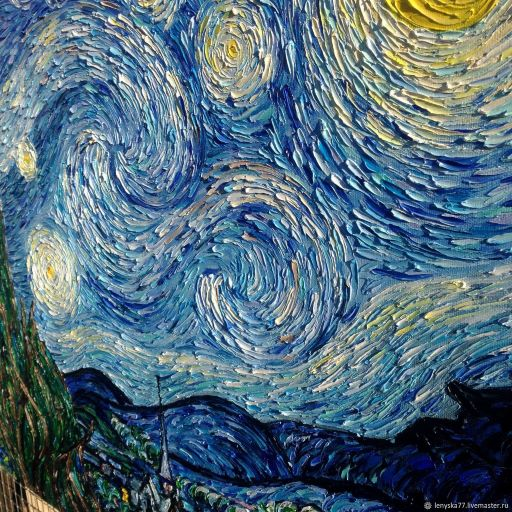
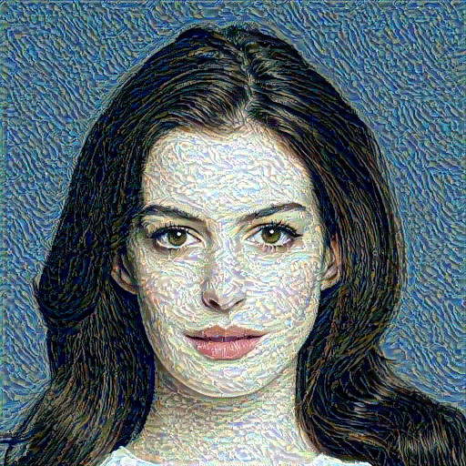
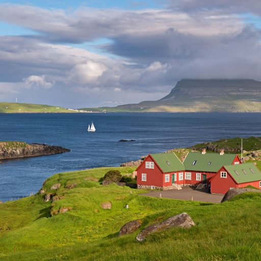
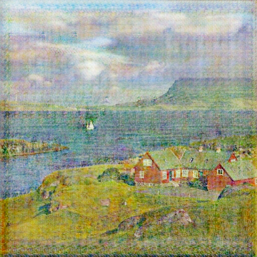

# Style transfer telegram bot
Данный telegram-бот переносит стиль с фотографии на фотографию.

## Режимы работы 
Предусмотрено 2 режима работы:
- Классический перенос стиля с одного изображения на другое (NST, медленный алгоритм)
- Стилизация изображений под картины Клода Моне (cycle GAN)

### Классический перенос стиля
#### Стандартные настройки:
- Количество итераций: `300`
- Размер изображения: `256x256` пикселей
- Коэффициент стиля: `0.01` (влияет на вклад стиля в результирующее изображение)

#### Расширенные настройки:
- Количество итераций
    - `100`
    - `300`
    - `1000`
    - `2000`
- Размер результата:
    - `64x64` пикселей
    - `128x128` пикселей
    - `256x256` пикселей
    - `512x512` пикселей

#### Возможный результат работы данного режима:
|   Оригинал   |      Стиль      |     Результат      |
|:------------:|:---------------:|:------------------:|
|  |  |  |

### Стилизация изображений под картины Клода Моне

#### Стандартные настройки:
- Размер изображения: `256x256` пикселей

#### Расширенные настройки:
- Размер результата:
    - `64x64` пикселей
    - `128x128` пикселей
    - `256x256` пикселей
    - `512x512` пикселей

#### Возможный результат работы данного режима:
|     Оригинал     |   Результат    |
|:----------------:|:--------------:|
|  |  |

## Запуск бота
В файле `config.py` необходимо указать токен Вашего бота, 
который можно получить у https://t.me/BotFather.

```python
TOKEN = '<YOUR TOKEN>'
```

В этом же файле можно изменить дефолтные настройки:
```python
NUM_STEPS = 300
IMAGE_SIZE = 256
STYLE_COEF = 0.01
```

Далее необходимо запустить скрипт `bot.py`.

## Дополнительная информация
По всем остальным вопросам: https://t.me/interpolat1on.